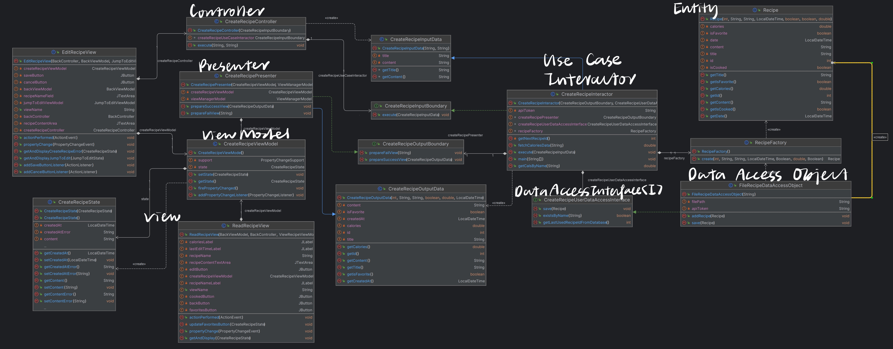
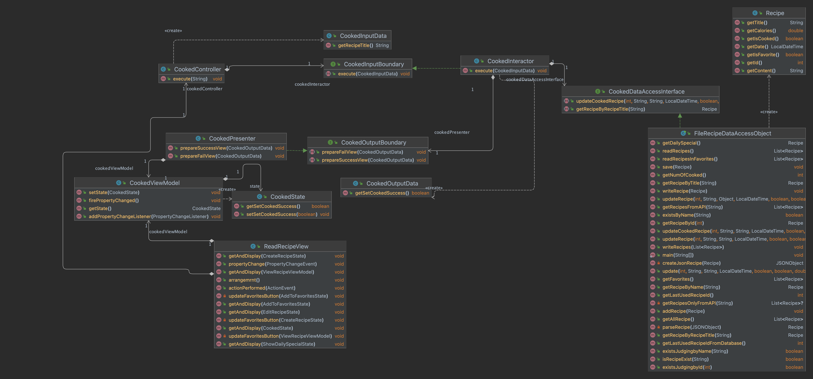

# Recipe Organizer

### Plate Pal: Your Culinary Partner

Are you hungry and willing to cook today? Do you have a lot of ingredients in your fridge but don't know what to cook? Do you want to try something new? Plate Pal is here to help you! Plate Pal is a recipe organizer that helps you to find recipes based on the ingredients you have. It also allows you to save your favorite recipes and share them with your friends. Plate Pal is your culinary partner! In the heart of every kitchen lies not just ingredients and utensils, but cherished recipes that tell stories of family gatherings, beloved traditions, and adventurous culinary experiments. A Recipe Organizer serves as the guardian of these culinary treasures, offering a dedicated space to compile, categorize, and curate every dish that holds meaning. Whether you're a seasoned chef or a budding cook, this tool ensures that your recipes are easily accessible, neatly organized, and preserved for generations to come. Dive into the world of organized cooking and let your flavors tell their tales!

## Features and Functionality

- **Recipe Storage:** Store all your favorite recipes in one repository (We can call it Favorites).
- **Categorization:** Classify recipes by type, cuisine, dietary preference, etc.
- **Searching:** Find recipes based on ingredients, name, or other keywords.
- **Recipe Scaling:** Adjust ingredient quantities based on the number of servings.
- **Meal Planning:** Plan your meals and create a shopping list.
- **Social Sharing:** Share recipes with friends and family across various platforms.
- **Personal Notes:** Add personal tips, tricks, and notes recipes.
- **Image Upload:** Attach photos to recipes, showcasing the finished dish or specific steps.
- **Recipe Rating:** Rate recipes.
- **Recipe Reviews:** Read and write reviews for recipes.

## Special Commitment

To say thanks for sharing your time and knowledge, for every 50 dishes you cook, we will plant a tree in your honor.

## Main Program

To run our software, simply execute the `Main.java` file. This is the primary entry point of our application. Follow these steps to get started:

1. Make sure you have IntelliJ IDEA installed, which comes with an integrated Java environment. If not, download and install it from [IntelliJ IDEA's official website](https://www.jetbrains.com/idea/download/).
2. Open the project in IntelliJ IDEA.
3. Locate the `src/app/Main.java` file in the project explorer.
4. Right-click on the `Main.java` file and select `Run 'Main.main()'` to start the application.
5. Recipe Organizer should now be spiced up!

If you encounter any issues, please do not hesitate to contact us via email for assistance. Our support team is always ready to help. You can find our contact information in the 'About Us' section of this document.

## About Us

- We are Team JAEX! (Group #197)
- [Aria (Zhihan) Hu](mailto:aria.hu@mail.utoronto.ca)
- [Mingzhe Zhang](mailto:mzhe.zhang@mail.utoronto.ca)
- [Qipeng Zheng](mailto:jamesqp.zheng@mail.utoronto.ca)
- [Shizhao Zheng](mailto:shizhao.zheng@mail.utoronto.ca)

## Special Thanks

- Ruihuan He (TA): Thank you for your instructions and help during the semester!
- Prof. Lindsey Shorser: Thank you for your guidance and support during the semester!

    

##################### Development Plan ######################

## API Usage

**Discarded API**

We have identified an API that can be utilized for our project. The details and endpoint can be accessed at [Recipe - Food - Nutrition API](https://spoonacular-recipe-food-nutrition-v1.p.rapidapi.com/recipes/complexSearch).

Here's the screenshot of using a tool to try out the API: 

I also test the example output of running my Java code: 

**API Ninjas**

After comparing several APIs, we decided to use the [API Ninjas](https://api-ninjas.com/) for our project. The reason is that the Ninja API provides more information about the recipes, including the ingredients, instructions, nutrition, and calories. It also provides more endpoints for us to use. The Ninja API is also easier to use and has a better user interface.

- [Recipe API](https://api-ninjas.com/api/recipe): Our project leverages the Recipe API, providing users with an extensive array of recipes through a straightforward search. This enhances the overall home cooking experience by offering a diverse selection of culinary options.
- [Nutrition API](https://api-ninjas.com/api/nutrition): Our project utilizes the Nutrition API to retrieve detailed nutritional information for our recipes based on the cuisine's name, presenting this valuable data to users.

[//]: # (Screenshots and usage goes here)

**A list of any technical problems blocking progress**

- [X] Find and Use an API
- [X] Learn how to use the API
- [X] Learn how to use the API in Java
- [X] Push the code to GitHub successfully
- [X] Use Git to manage the project
- [X] How to visualize the data after calling from the API

Perfect! We have successfully solved the problems and can use the APIs in our project.

## UML Diagram

In our software design, we apply Clean Architecture. The following diagram shows the relationship between the entities in our project.

**Preliminary Diagram Design**

Based on the entities, we can draw the following UML Diagram: 

**Final Diagram Design**

Here are two examples of the UML Diagrams we have designed for our project.

- `createRecipe` use case: 
The architecture ensures communication between higher and lower-level modules via abstractions and has better independence, maintainability, and flexibility.

- `Cooked` use case: 
The process demonstrates Clean Architecture, with distinct roles for the UI, Controller, Interactor, DataAccessObject, and Presenter, promoting maintainability through clear interfaces and following the Single Responsibility Principle (SRP).

**Design Pattern**

Now, let me introduce how we apply the Observer Design Pattern in our program. For example, when the user does an action, assume it triggers a series of operations in the ViewWarehouseViewModel, including setting the state and firing a property change. 'Set state' updates the ViewWarehouseState, while 'fire property change' go through this way notifies observers that their state has changed. This is particularly relevant for the WarehouseView, which implements the PropertyChangeListener interface. After receiving this notification, the WarehouseView responds to the event, typically by calling getDataAndDisplay to update the user interface. Through this strategy, we ensure that the ViewModel, as the publisher, can effectively notify about state changes without directly interacting with the observer. This allows the WarehouseView, acting as a listener, to always display the latest recipe information. As a result, every time a user visits the warehouse, they are presented with the most updated and comprehensive list of recipes.

In addition to this, we also used the strategy design pattern. We want the program to have some predefined recipes to serve, partly from local database and partly from the recommendation of the API. In order to achieve this, Main calls the methods of Context. like this, to create predefined recipe. The strategy pattern allows our "Context" class to choose dynamically which algorithms to execute without having to implement those algorithms inside the class, Specifically, the "LocalStrategy" provides access to a local database, while the "APIStrategy" provides access to the latest globalized recipes via an API. Both strategies implement the "Strategy" interface, which ensures the consistency of behavior between different strategies. In this way, every time the user open or update our application, they can get the most updated and popular recipes from local database and API.

**Organization**

Our directory structure adopts a 'layered' approach, enhancing modularity and clarity. Each layer focuses on specific functionalities, improving maintainability. The code is well-organized and uses camel case naming for better readability. Modular design facilitates testing and reduces code coupling. Documentation and comments elucidate decisions, aiding team understanding and increasing collaborative efficiency

[//]: # (Week of 10/23 Plan:)

[//]: # (Implement the usercase: create_recipe)

[//]: # (controller:Shizhao,Qipeng)

[//]: # (presenter: Mingzhe, Aria)

[//]: # (interactor: Aria, Shizhao,)

[//]: # (data_access_object:Shizhao, Aria, Qiepng, Mingzhe)

[//]: # (Design a low-fidelity UI design: Aria, Shizhao)

