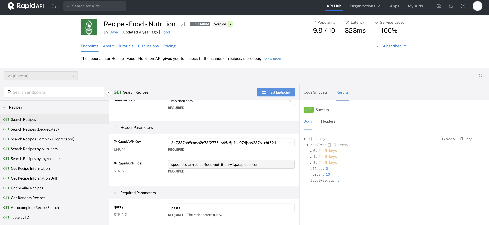
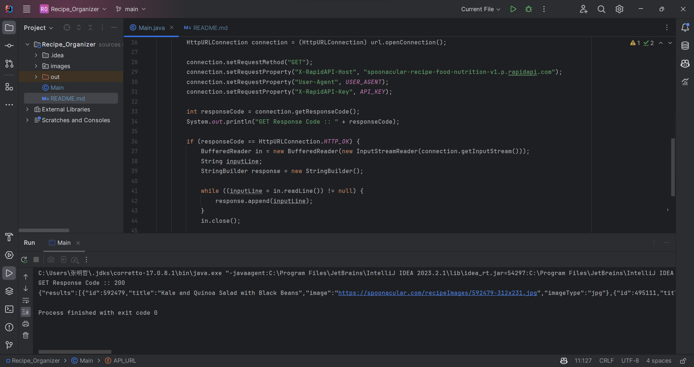
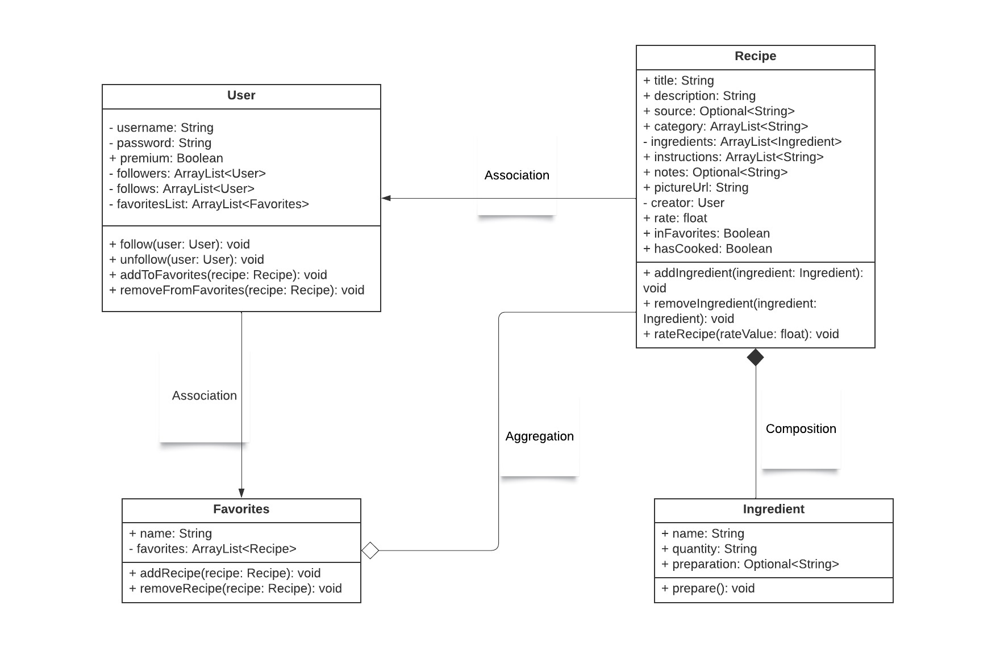

# Recipe Organizer

### Plate Pal: Your Culinary Partner

Are you hungry and willing to cook today? Do you have a lot of ingredients in your fridge but don't know what to cook? Do you want to try something new? Plate Pal is here to help you! Plate Pal is a recipe organizer that helps you to find recipes based on the ingredients you have. It also allows you to save your favorite recipes and share them with your friends. Plate Pal is your culinary partner! In the heart of every kitchen lies not just ingredients and utensils, but cherished recipes that tell stories of family gatherings, beloved traditions, and adventurous culinary experiments. A Recipe Organizer serves as the guardian of these culinary treasures, offering a dedicated space to compile, categorize, and curate every dish that holds meaning. Whether you're a seasoned chef or a budding cook, this tool ensures that your recipes are easily accessible, neatly organized, and preserved for generations to come. Dive into the world of organized cooking and let your flavors tell their tales!

## Features and Functionality

- **Recipe Storage:** Store all your favorite recipes in one repository (We can call it Favorites).
- **Categorization:** Classify recipes by type, cuisine, dietary preference, etc.
- **Searching:** Find recipes based on ingredients, name, or other keywords.
- **Recipe Scaling:** Adjust ingredient quantities based on the number of servings.
- **Meal Planning:** Plan your meals and create a shopping list.
- **Social Sharing:** Share recipes with friends and family across various platforms.
- **Personal Notes:** Add personal tips, tricks, and notes recipes.
- **Image Upload:** Attach photos to recipes, showcasing the finished dish or specific steps.
- **Recipe Rating:** Rate recipes.
- **Recipe Reviews:** Read and write reviews for recipes.

## Special Commitment

To say thanks for sharing your time and knowledge, for every 50 dishes you cook, we will plant a tree in your honor.

## Main Program

To run our software, simply execute the `Main.java` file. This is the primary entry point of our application. Follow these steps to get started:

1. Ensure that Java is installed on your system. If not, download and install it from [Java's official website](https://www.java.com/download/).
2. Navigate to the `src/app/Main.java` file.
3. Recipe Organizer should now be spiced up!

If you encounter any issues, please contact us .

## About Us

- We are Team JAEX! (Group #197)
- Aria (Zhihan) Hu
- Mingzhe Zhang
- Qipeng Zheng
- Shizhao Zheng

## Special Thanks

- Ruihuan He (TA)
- Thank you for your instructions and help during the semester!

##################Development Plan###################

## API Usage

We have identified an API that can be utilized for our project. The details and endpoint can be accessed at [Recipe - Food - Nutrition API](https://spoonacular-recipe-food-nutrition-v1.p.rapidapi.com/recipes/complexSearch).

Here's the screenshot of using a tool to try out the API: 

I also test the example output of running my Java code: 

**A list of any technical problems blocking progress**

- Find and Use an API
- Learn how to use the API
- Learn how to use the API in Java
- Push the code   to GitHub successfully
- Use Git to manage the project
- How to visualize the data after calling from the API

## UML Diagram
Based on the entities, we can draw the following UML Diagram: 

[//]: # (Week of 10/23 Plan:)

[//]: # (Implement the usercase: create_recipe)

[//]: # (controller:Shizhao,Qipeng)

[//]: # (presenter: Mingzhe, Aria)

[//]: # (interactor: Aria, Shizhao,)

[//]: # (data_access_object:Shizhao, Aria, Qiepng, Mingzhe)

[//]: # (Design a low-fidelity UI design: Aria, Shizhao)

